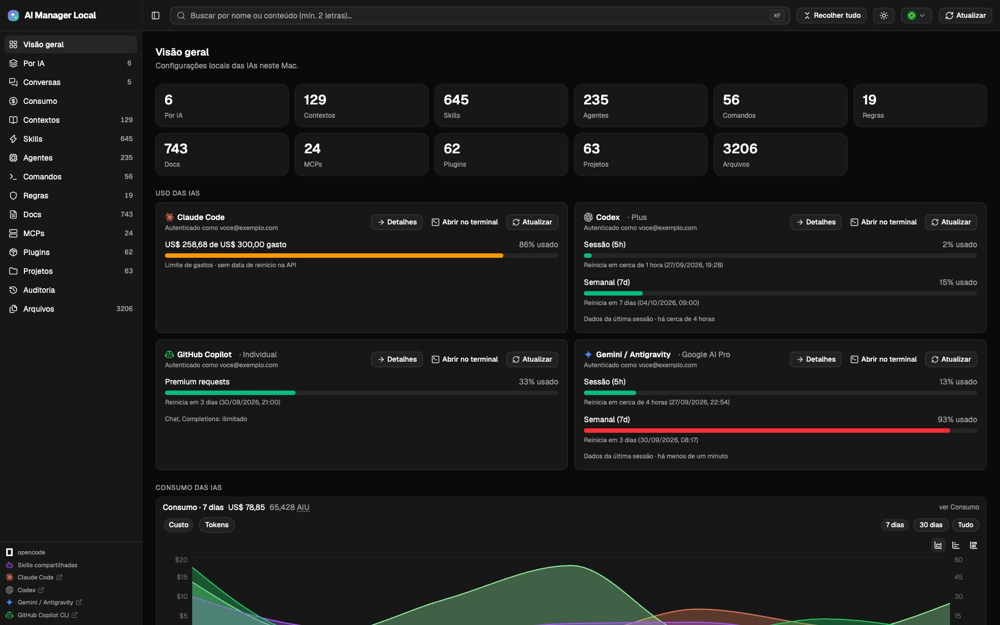

# AI Manager Local

Panel web local (solo en tu Mac) para visualizar y editar las configuraciones de las IAs instaladas en la máquina: **opencode**, **Claude Code**, **Codex**, **GitHub Copilot CLI**, **Gemini/Antigravity** y los archivos de configuración **dentro de tus proyectos** (`~/Projetos`).

[](https://github.com/mvvitorsilvati/ai-manager-local/actions/workflows/qa.yaml)


**Leer en:** [Português (Brasil)](README.md) · [English](README.en.md)

**Sistemas operativos:** macOS es la plataforma de destino completa (Keychain, Finder, aplicaciones nativas y sus iconos). Linux, WSL y contenedores ejecutan el panel con las características multiplataforma; las diferencias se detallan en [Limitaciones](#limitaciones). En WSL con las IAs instaladas en Windows, usa `AIM_HOME` — consulta [Uso en WSL](#uso-en-wsl-ias-instaladas-en-windows).

**Sitio web:** https://mvvitorsilvati.github.io/ai-manager-local/es/ (página de inicio servida por GitHub Pages desde `site/`)

Se ejecuta 100% local (`127.0.0.1`), sin telemetría y sin enviar nada al exterior — excepto las llamadas a las APIs oficiales: uso/límites de las cuentas (Claude, Codex, Copilot, Gemini y Cursor), versiones publicadas en npm y las páginas de estado, siempre con las credenciales que ya existen en tu equipo.



## Funcionalidades principales

- **Por IA y por proyecto**: todo de cada herramienta (opencode, Claude, Codex, Copilot, Gemini), global y por repositorio en `~/Projetos`
- **Visor y edición segura**: Markdown/Mermaid, JSON, imágenes, editor Monaco con copia de seguridad automática y detección de conflictos
- **Uso, consumo y skills**: límites de cuentas, costo/tokens por modelo, proyecto y día (gráficos) y top 20 de skills
- **Historial de conversaciones**: sesiones completas con tokens, costos calculados, conteo de mensajes, filtros Top 20 y reanudación con un clic en terminal
- **Statusline de terminal**: barra de estado en tiempo real para Claude Code y Antigravity (`just statusline`), con vista previa web e instalador interactivo
- **Instaladores oficiales de IA**: detección de asistentes no instalados con comandos y enlaces oficiales de documentación
- **Operación**: MCPs, plugins, versiones y actualizaciones, apertura de la IA en terminal o app nativa, auditoría y logs
- **Búsqueda, idiomas y tema**: búsqueda global y contextual (`⌘F`), atajos globales (`⌘A`, `⌃⌘T`, `⌃⌘R`, `⌘B`, `⌘L`), interfaz en PT-BR/EN/ES y modo claro/oscuro

Detalles en [Qué hace](#qué-hace).

## Índice

- [Funcionalidades principales](#funcionalidades-principales)
- [Qué hace](#qué-hace)
- [Stack](#stack)
- [Requisitos](#requisitos)
- [Instalación](#instalación)
- [Configuración (.env)](#configuración-env)
- [Uso](#uso)
- [Arquitectura](#arquitectura)
- [API](#api)
- [Fuentes escaneadas](#fuentes-escaneadas)
- [Pruebas](#pruebas)
- [Lint y formateo](#lint-y-formateo)
- [Limitaciones](#limitaciones)
- [Solución de problemas](#solución-de-problemas)
- [Cómo contribuir](#cómo-contribuir)
- [Licencia](#licencia)

## Qué hace

El panel lee lo que ya está en tu máquina, global y por proyecto, y lo organiza en dos formas de navegación. Por tipo de artefacto: contextos, skills, agentes, comandos, reglas, documentación, MCPs, plugins, archivos y auditoría. Por IA: selecciona la herramienta (opencode, Claude, Codex, Copilot, Gemini o lo compartido) y visualiza todo sobre ella, incluidos los repositorios encontrados en `~/Projetos`.

### Lectura y edición

El visor abre Markdown con Mermaid, JSON, imágenes y texto plano, mostrando metadatos del archivo y el autor del último commit. La edición se realiza en Monaco y cada guardado crea una copia de seguridad (10 versiones por archivo). Si el archivo cambia fuera del panel, te avisa en lugar de sobrescribirlo. Los guardados y restauraciones se registran en `audit.log`.

### Búsqueda

En la Vista General, el campo busca en todo el catálogo por nombre y contenido, resaltando las líneas coincidentes. En las demás pantallas, filtra el contenido visible.

### Uso y consumo

Las tarjetas de uso muestran la cuenta autenticada y los límites para Claude Code (ventanas de 5h y 7d, o créditos), Codex (5h y 7d, leídos del último despliegue), GitHub Copilot (solicitudes premium y reinicio mensual), Gemini/Antigravity (ventanas de 5h y 7d) y Cursor (porcentajes del uso incluido — Auto y API — y el on-demand en $ cuando exista; el uso incluido no tiene valor en $ para mostrar). La sección de consumo lee los logs locales de las CLIs y construye gráficos de costo y tokens por día, por modelo o por IA, con tablas detalladas por modelo y proyecto. Son precios de lista oficiales, no tu factura; Copilot se muestra en AIU.

### Historial de conversaciones

Permite revisar el historial de sesiones por IA o proyecto, mostrando en la primera línea el costo en USD, tokens totales y número de mensajes. Incluye filtros Top 20 por costo y tokens, vista completa de mensajes en Markdown y copia del comando nativo de reanudación (`--resume`). La Visión general muestra las conversaciones recientes y el total de sesiones.

### Statusline de terminal

Barra de estado de alto rendimiento para terminal integrada con Claude Code y Antigravity (`agy`), que muestra porcentajes de cuota, ventana de contexto, gasto y diff de Git en tiempo real sin consumo extra de tokens.

### Skills

Top 20 por invocaciones, agrupadas por nombre entre las distintas IAs, con los tokens de contexto aproximados. Solo Claude y opencode registran invocaciones localmente.

### Versiones y actualizaciones

Compara la versión instalada de cada CLI con la última publicada en npm. **Actualizar** ejecuta brew, npm o el actualizador propio de la herramienta; **Copiar comando** proporciona el comando listo para ejecutar en tu terminal. Para plugins, muestra si la actualización es automática o manual y permite alternarla.

### MCPs

La activación y desactivación se realiza en la propia tarjeta: opencode y Codex editan el archivo de configuración (con copia de seguridad) y Copilot y Gemini lo gestionan vía CLI. El inicio de sesión OAuth también se encuentra aquí (Claude, opencode y Codex). Las acciones de autenticación solo aparecen en los MCPs que las necesitan: cuando se conoce el estado, la tarjeta muestra **Iniciar sesión** o **Cerrar sesión**, según corresponda. Los botones de activación y autenticación tienen colores distintos. **Ver config** funciona para todos, incluidos los MCPs de Claude que residen en `~/.claude.json`.

### Apertura de la IA

Un icono junto a cada IA abre la CLI en el terminal detectado (Terminal, iTerm2 y otros) o en la aplicación nativa (Claude, OpenCode, Gemini/Antigravity). El directorio es el del proyecto cuando existe contexto; fuera de un proyecto, es `AIM_PROJECTS_DIR`.

### Estado e interfaz

Se muestra una alerta en la barra lateral cuando una IA presenta un incidente activo, consultando las páginas de estado de Anthropic, OpenAI, GitHub, Google Cloud y Cursor. La interfaz está disponible en PT-BR, EN y ES, cuenta con tema claro/oscuro que sigue al sistema, atajos (`⌘K`, `⌘F`, `⌘A`, `⌘L`, `⌃⌘T`, `⌃⌘R`, `⌘B`, `⌘E`, `⌘S`, `Esc`) y navegación integrada con el historial del navegador.

## Logs y depuración

- **Backend** (Loguru): nivel mediante `AIM_LOG_LEVEL` (`DEBUG`, por defecto `INFO`); los fallos van a stderr y todo se registra en `~/.ai_management_local/backend.log` (rotación de 1 MB, 3 archivos). Nivel `info` en mutaciones (guardar/restaurar/actualizar/mcp/abrir), `warning` en respuestas 4xx, `error` con traceback en 500s, `debug` en llamadas externas.
- **Frontend** (`web/src/lib/log.ts`, sin dependencias): `warn`/`error` siempre en la consola; `debug`/`info` solo con `?debug=1` o `localStorage "aim:debug" = "1"`. Búfer de los últimos 500 registros exportable mediante `downloadLogs()` (o `__AIM_LOGS__` en consola). Los fallos de API generan un `warn` con método, ruta y código de estado (sin cuerpos ni secretos).

## Stack

- **Backend**: Python 3.14, biblioteca estándar (`http.server`) + [trio](https://trio.readthedocs.io/) y [httpx](https://www.python-httpx.org/), gestionado con [uv](https://docs.astral.sh/uv/)
- **Frontend**: Vite + React + TypeScript (TS 7), Tailwind CSS v4, shadcn/ui (Base UI), react-router, TanStack Query, react-markdown, Mermaid, Monaco Editor, axios, date-fns, lucide-react
- **Calidad**: pytest (unitarias/integración/e2e), Vitest, Ruff, Pyright, oxlint, oxfmt
- **Ejecutor de tareas**: [just](https://github.com/casey/just)

## Requisitos

| Herramienta | Versión | Para qué |
|---|---|---|
| macOS | — | el backend utiliza Keychain y `open -R` (Finder); en Linux/Windows funciona con excepción de esas dos funciones |
| [uv](https://docs.astral.sh/uv/) | 0.8+ | venv y dependencias del backend |
| Python | 3.14 | entorno de ejecución del backend |
| Node.js | 22+ | compilación y desarrollo del frontend (Vite 8) |
| [pnpm](https://pnpm.io/) | 10+ | dependencias del frontend |
| [just](https://github.com/casey/just) | 1.x | atajos de tareas (opcional) |
| Podman o Docker | — | opcional, solo para ejecutar en contenedor |

Para las tarjetas de uso (opcional): `gh` autenticado (Copilot), Claude Code iniciado (Keychain) y Cursor instalado y con sesión iniciada (la tarjeta lee la sesión del editor); sin ellos, la tarjeta simplemente no aparece.

## Instalación

```bash
git clone git@github.com:mvvitorsilvati/ai-manager-local.git
cd ai-manager-local

# instala el backend (uv sync) y el frontend (pnpm install)
just setup

# compila el frontend (el backend sirve la compilación en /)
just build
```

Sin `just`:

```bash
cd backend && uv sync && cd ..
cd web && pnpm install && pnpm build
```

## Configuración (.env)

Copia el ejemplo y ajusta según necesites:

```bash
cp .env.example .env
```

| Variable | Por defecto | Descripción |
|---|---|---|
| `AIM_HOME` | home del proceso | directorio personal donde el panel busca las IAs (configuraciones, credenciales y logs de uso). Solo se requiere si las IAs se ejecutan en otro sistema, como WSL con las IAs en Windows: `AIM_HOME=/mnt/c/Users/<usuario>` |
| `AIM_PROJECTS_DIR` | `~/Projetos` | directorio donde el panel busca tus proyectos (acepta `~`, que sigue a `AIM_HOME`) |
| `AIM_PORT` | `4747` | puerto del servidor local (la opción `--port` tiene precedencia) |
| `AIM_HOST` | `127.0.0.1` | interfaz de escucha; usa `0.0.0.0` solo en contenedor (la opción `--host` tiene precedencia) |

El archivo `.env` reside en la raíz del repositorio, se carga con [python-dotenv](https://github.com/theskumar/python-dotenv) **sin sobrescribir** variables ya exportadas en el entorno, y no se versiona en Git (solo `.env.example`). ¿Cambiaste algo? Reinicia el servidor (`just stop && just run`).

## Uso

```bash
just run        # inicia y abre http://127.0.0.1:4747
just stop       # detiene la instancia en el puerto 4747
```

| Comando | Qué hace |
|---|---|
| `just run` | backend + aplicación compilada en `http://127.0.0.1:4747` (abre el navegador) |
| `just run-nobrowser` | igual, sin abrir el navegador |
| `just dev` | frontend con recarga en caliente en `http://127.0.0.1:5173` (proxy `/api` → 4747; ejecutar backend en paralelo) |
| `just build` | compila el frontend en `web/dist` |
| `just test` | pytest (backend, con cobertura) + Vitest (frontend) |
| `pnpm test:e2e` (en `web/`) | E2E con Playwright (chromium) |
| `just coverage` | cobertura del backend + informe HTML en `backend/htmlcov` |
| `just e2e` | pruebas E2E (Playwright) — compila el frontend y ejecuta el backend con fixtures |
| `just lint` | Ruff + Pyright + oxlint |
| `just format` | oxfmt (frontend) + `ruff check --fix` (backend) |
| `just check` | linters + pruebas |
| `just hooks` | activa los git hooks versionados (pre-commit ejecuta `just check`) |
| `just statusline [target]` | instala la statusline para Claude Code y/o Antigravity (interactivo) |
| `just version` | imprime la versión del proyecto (backend/pyproject.toml) |
| `just docker-build` | construye la imagen `localhost/ai-manager-local-py-3.14:<versión del pyproject>` |
| `just docker-run` | ejecuta el panel en un contenedor montando tu `$HOME` |
| `just docker-test` | ejecuta la suite de pruebas dentro de la imagen (sin red) |

### Statusline (Claude Code y Antigravity / agy)

El proyecto incluye barras de estado personalizadas de alto rendimiento para **Claude Code** (`~/.claude/`) y **Google Antigravity CLI (`agy`)** (`~/.gemini/antigravity-cli/`).
Muestran cuotas de tokens en tiempo real (ventanas de 5h, 7d y mensual), uso de ventana de contexto, costo acumulado de la sesión, rama de Git y estadísticas de diff (+X/-Y) sin sobrecarga de tokens.

La instalación es siempre opcional:

```text
Deseja instalar os statusline para o claude-code e ou agy?

  [ ] 1. Ambos
  [ ] 2. Claude
  [ ] 3. Antigravity
  [X] 4. Não fazer nada (padrão)
```

**Opciones de instalación:**

1. **Vía línea de comandos (`just`):**
   ```bash
   just statusline             # interactivo (por defecto: no hacer nada en Enter)
   just statusline both        # instala Claude Code y Antigravity
   just statusline claude      # instala solo Claude Code
   just statusline antigravity # instala solo Antigravity
   just statusline none        # opción explícita sin cambios
   ```

2. **En contenedor (Docker / Podman):**
   - Configura `AIM_STATUSLINE_INSTALL: "both"` (o `"claude"` / `"antigravity"`) en `docker-compose.yml`.
   - O ejecuta manualmente dentro del contenedor:
     ```bash
     docker compose exec app bash statusline/install.sh
     ```

3. **Desde la interfaz web:**
   - En el **Dashboard** y en la pantalla **Por IA** (`/ia`), la tarjeta **Statusline (CLI)** muestra el estado actual y permite aplicar la instalación con un clic, generando copias de seguridad automáticas (`.bak-<timestamp>`).

### Ejecución en contenedor (Docker/Podman)

```bash
just docker-build   # podman build -t localhost/ai-manager-local-py-3.14:<versión del pyproject> .
just docker-run     # http://127.0.0.1:4747
```

O con Compose: `podman compose up --build` (o `docker compose up --build`) — la etiqueta de la imagen viene de `AIM_VERSION` (valor por defecto del archivo); usa `AIM_VERSION=$(just version)` para fijarla a la versión actual.

El contenedor monta tu `$HOME` en `/host-home` (con `HOME` apuntando allí), de modo que las fuentes escaneadas, las copias de seguridad y `audit.log` se mantienen en tu máquina. El puerto se expone **únicamente en el loopback del host** (`127.0.0.1:4747`).

### Uso en WSL (IAs instaladas en Windows)

El panel construye sus fuentes a partir del directorio home (`AIM_PROJECTS_DIR` solo cambia la carpeta de proyectos), por lo que no ve `C:\` de forma automática. Si las IAs se ejecutan en Windows y el panel en WSL, apunta `AIM_HOME` al perfil de Windows, en `.env` o en la línea de comandos:

```bash
# ejecución nativa en WSL
AIM_HOME=/mnt/c/Users/<usuario> uv run --project backend backend/app.py

# contenedor: descomenta el volumen y AIM_HOME en docker-compose.yml
#   - /mnt/c/Users/<usuario>:/host-windows
#   AIM_HOME: /host-windows
docker compose up --build
```

Así se leen los archivos de las IAs, los logs de uso, las credenciales de Claude (`~/.claude/.credentials.json`) y la última sesión de Codex (`~/.codex/sessions`). Las copias de seguridad y `audit.log` quedan en el home real (`~/.ai_management_local`). Si las IAs se ejecutan dentro de WSL, no necesitas `AIM_HOME`.

En comparación con macOS:

- La tarjeta de GitHub Copilot necesita un token: `GITHUB_TOKEN` o `GH_TOKEN`, `gh auth token` o `~/.config/gh/hosts.yml`. El `gh` de Windows guarda la sesión en `%APPDATA%\GitHub CLI\`; autentica `gh` dentro de WSL.
- La apertura en aplicaciones nativas (Claude, OpenCode, Gemini/Antigravity) y sus iconos solo están disponibles en macOS. En WSL se ofrecen los terminales Linux instalados.
- «Revelar en Finder» responde con `400` y Windows Terminal no aparece en la lista de terminales: `wt` solo corresponde a `win32`.
- Si `AIM_HOME` apunta a Windows, las copias y `audit.log` se guardan en `C:\Users\<usuario>\.ai_management_local`. Escanear `/mnt/c` es más lento que ext4 y las rutas `C:\...` de los archivos de configuración solo se muestran como texto.

### Flujo de desarrollo

```bash
# terminal 1 — API
just run-nobrowser

# terminal 2 — frontend con HMR
just dev
```

### Atajos de teclado

| Tecla | Acción |
|---|---|
| `⌘F` | enfoca la barra de búsqueda global |
| `⌘A` | colapsa o expande todas las carpetas (cuando no se está editando texto) |
| `⌘L` | alterna entre idiomas (Português → English → Español) |
| `⌃⌘T` | alterna entre tema claro y oscuro |
| `⌃⌘R` | actualiza los datos sin recargar el navegador |
| `⌘B` | colapsa o expande el menú lateral |
| `⌘K` | abre el menú de comandos |
| `⌘E` | entra en modo de edición (Monaco) |
| `⌘S` | guarda los cambios (con copia de seguridad automática) |
| `Esc` | cierra el panel de copias de seguridad o cancela la edición |

### Edición y copias de seguridad

- Al guardar, el archivo anterior se almacena en `~/.ai_management_local/backups/<fuente>/<ruta>/<timestamp>-<nombre>` (mantiene las 10 versiones más recientes).
- Si el archivo cambió en el disco desde que se abrió, el guardado se bloquea con `409` y puedes elegir entre **sobrescribir** o **recargar del disco**.
- Cada escritura se registra en `~/.ai_management_local/audit.log` de forma atómica (`os.replace`).
- Se valida la sintaxis antes de escribir: JSON, JSONC y TOML inválidos se rechazan con `422`.

## Arquitectura

```
ai-manager-local/
├── Dockerfile                # multi-stage: build frontend (Node) + runtime (Python 3.14 + uv)
├── docker-compose.yml        # ejecuta el panel montando $HOME
├── .dockerignore
├── backend/                  # API + servicio del frontend
│   ├── app.py                # servidor HTTP (stdlib), catálogo, escrituras, uso de IA
│   ├── pyproject.toml        # dependencias (trio, httpx) + config pytest/ruff/pyright
│   ├── uv.lock
│   └── tests/
│       ├── conftest.py       # fixtures compartidos
│       ├── unit/             # parsers, árbol, uso, versiones, MCPs
│       ├── integration/      # guardar/backup/restaurar, git
│       └── e2e/              # servidor HTTP real (rutas y flujos)
├── web/                      # frontend React (Vite)
│   ├── src/
│   │   ├── components/       # FileTree, Viewer, UsageCard, Markdown, CodeEditor, ui/ (shadcn)
│   │   ├── views/            # Dashboard, Por IA, categorías, Proyectos, Docs, MCPs, Plugins, Sesiones
│   │   ├── hooks/            # useCatalog (react-query)
│   │   └── lib/              # api (axios), format (date-fns), i18n, locales
│   └── .oxfmtrc.json / .oxlintrc.json
└── justfile                  # tareas del proyecto
```

### Cómo se comunican los componentes

```
Navegador (SPA React en /) ──HTTP/JSON──▶ backend/app.py (127.0.0.1:4747)
        │                                        │
        │  /api/catalog, /api/file, ...          ├─ lee archivos (fuentes y proyectos)
        │  POST /api/save (X-AIM: 1)          ├─ guarda con backup, escritura atómica y auditoría
        ▼                                        └─ consulta las API de uso (Claude/Codex/Copilot)
   web/dist (build) ◀── servido por el mismo proceso
```

El backend escanea las fuentes en cada petición al catálogo, sin base de datos. El frontend usa TanStack Query como caché (catálogo: 10 s; uso: 5 min con `refetchInterval`).

### Seguridad

- El servidor solo escucha en `127.0.0.1` por defecto; en contenedor, `AIM_HOST=0.0.0.0` con el puerto publicado únicamente en el loopback del host.
- Cada petición `POST` requiere la cabecera `X-AIM: 1` (bloquea CSRF desde páginas externas).
- `resolve_file` garantiza que cualquier ruta resuelta pertenezca a una fuente permitida (sin path traversal) y bloquea extensiones no autorizadas.
- La API nunca devuelve secretos extraídos de las configuraciones (ej. cabeceras de autorización de MCPs).

## API

| Método | Ruta | Descripción |
|---|---|---|
| GET | `/` | frontend React (compilación en `web/dist`; `503` con instrucciones si no existe) |
| GET | `/api/catalog` | fuentes, proyectos, herramientas, archivos, skills, MCPs y plugins |
| GET | `/api/file?s=&r=` | contenido + metadatos (tamaño, mtime, mtime_ns, creado, propietario, git) |
| GET | `/api/raw?s=&r=` | bytes originales (imágenes, hasta 20 MB) |
| GET | `/api/search?q=` | búsqueda por nombre y contenido |
| GET | `/api/sessions` | historial de conversaciones, tokens, costos y mensajes por IA o proyecto |
| GET | `/api/backups?s=&r=` | versiones de copia de seguridad del archivo |
| GET | `/api/usage[?refresh=1][&tool=claude\|codex\|copilot\|gemini\|cursor]` | uso/límites de Claude, Codex, Copilot, Gemini y Cursor (caché de 60 s) |
| GET | `/api/spend[?days=7][&tool=][&refresh=1]` | costo y tokens locales (claude, codex, opencode, copilot) |
| GET | `/api/skill-usage[?days=7][&tool=][&refresh=1]` | invocaciones de skills y tokens aprox. de contexto (Top 20 global) |
| GET | `/api/versions[?refresh=1]` | versiones CLI instaladas/recientes, cuentas autenticadas y actualizaciones |
| GET | `/api/incidents[?refresh=1]` | incidentes activos en las páginas de estado de las IAs |
| GET | `/api/audit[?limit=200]` | últimas operaciones registradas en `audit.log` |
| POST | `/api/save` | guarda `{s, r, content, mtime_ns?, force?}` |
| POST | `/api/restore` | restaura `{s, r, backup}` |
| POST | `/api/authors` | autores (autor/committer/co-autores) en lote para la lista reciente |
| POST | `/api/reveal` | revela el archivo en el Finder (macOS) |
| POST | `/api/update` | actualiza una CLI o un plugin a la versión más reciente |
| POST | `/api/plugin-auto-update` | activa/desactiva la actualización automática de un plugin |
| POST | `/api/mcp` | activa/desactiva o autentica/desconecta un MCP |
| GET | `/api/open-targets?tool=` | terminales detectados y apps nativas vinculadas a la IA |
| GET | `/api/app-icon?app=` | icono PNG de la aplicación nativa |
| POST | `/api/open` | abre la IA en el terminal o app seleccionada |

## Fuentes escaneadas

| Fuente | Ruta | Contenido |
|---|---|---|
| opencode | `~/.config/opencode` | `opencode.jsonc`, `agent/`, `command/`, `skills/`, `shared/`, `instructions/` |
| Skills compartidas | `~/.agents/skills` | skills utilizadas por varias herramientas |
| Claude Code | `~/.claude` | `CLAUDE.md`, `agents/`, `commands/`, `skills/`, `rules/`, `settings.json` |
| Codex | `~/.codex` | `config.toml`, `AGENTS.md`, `prompts/`, `rules/`, `skills/` |
| GitHub Copilot CLI | `~/.copilot` | `settings.json`, `mcp-config.json`, `hooks/`, `skills/` |
| Gemini / Antigravity | `~/.gemini` | `GEMINI.md`, `settings.json`, `config/`, `skills/` |
| Cursor | `~/.cursor` | `mcp.json` global y `.cursor/`, `.cursorrules`/`.windsurfrules` en proyectos, si existen; la tarjeta de uso lee la sesión del editor (`state.vscdb` en `~/Library/Application Support/Cursor`, `~/.config/Cursor` o `AppData/Roaming/Cursor`) |
| Proyectos | `AIM_PROJECTS_DIR` (`~/Projetos` por defecto) | detecta repositorios y escanea las rutas de configuración y `docs/` |

### Agregar una IA nueva

El registro `TOOLS` en `backend/app.py` centraliza la configuración: cada entrada define el directorio global (`root`), las rutas del proyecto (`dirs`/`files`), el archivo MCP (`mcp.rel` y `kind`/`container`), la CLI (`cli`), las acciones de autenticación y activación (`mcp_login`/`mcp_logout`, `mcp_enable`/`mcp_disable`) y la página de estado (`status`). La barra lateral y la pantalla «Por IA» muestran únicamente las fuentes configuradas.

El panel también **descubre automáticamente** herramientas no registradas: un `~/.<ia>/mcp.json` (o `.mcp.json`/`mcp_config.json`) con `mcpServers`, o un `~/Library/Application Support/<IA>/**/mcp.json`, se convierte en una fuente con MCPs visibles y conmutables desde el panel. Se usa un icono genérico hasta agregar la marca a `ToolIcon`.

Se excluyen automáticamente los binarios y cachés por extensión (`.pyc`, `.zip`, `.pdf`, fuentes, audio, SQLite y sus archivos `-wal/-shm/-journal`), los historiales `.jsonl`, los directorios de sesiones y cachés (`sessions/`, `projects/`, `cache/`, `worktrees/`, `session-state/`, `run/`) y los archivos de credenciales (`auth.json`).

## Pruebas

```bash
just test                      # ejecuta todas las pruebas
cd backend && uv run pytest    # solo backend (pytest)
cd web && pnpm test            # solo frontend (Vitest)
```

- `tests/unit`: parsers, categorización, skills, MCPs y exploración de directorios.
- `tests/integration`: escrituras con backup, conflictos por tiempo de modificación, restauración y consulta de autores de Git.
- `tests/e2e`: inicia un servidor HTTP real y verifica catálogo, lectura, guardado (incluidos `403` sin cabecera y `409` por conflicto), backups, restauración y la ruta `/`.

### Pruebas E2E (Playwright)

Inician la aplicación real con frontend compilado y backend en uv. `AIM_PROJECTS_DIR` apunta a una fixture copiada en `web/e2e/.tmp` antes de cada ejecución; la prueba de guardado no modifica los archivos versionados:

```bash
just e2e                     # build + playwright test
cd web && pnpm test:e2e      # sin recompilar
```

La suite cubre la vista general, el proyecto de ejemplo y su visor, la búsqueda con ⌘K, la edición con ⌘S y la cancelación con Esc. Las pruebas de edición pegan el texto en Monaco porque la escritura tecla por tecla puede perder caracteres. En CI, una prueba intermitente también hace fallar el job (`failOnFlakyTests`).

Si tu red bloquea la descarga de Chromium, usa el Chrome instalado en el sistema:

```bash
cd web && pnpm test:e2e:chrome
```

## Lint y formateo

```bash
just lint     # ruff check + pyright (backend) y oxlint (frontend)
just format   # ruff check --fix + oxfmt
```

## Limitaciones

El panel muestra lo que las herramientas guardan en el disco. Lo que no registran, no se inventa.

- **Skills por invocación**: solo Claude Code y opencode registran este historial. En las demás IAs se listan las skills presentes en disco sin recuento de uso.
- **Consumo**: costos y tokens provienen de logs locales a precios de lista, no de tu facturación real.
- **macOS**: Keychain, "revelar en Finder", aplicaciones nativas y sus iconos son exclusivos de macOS.
- **Sin base de datos**: el catálogo se lee directamente del disco en cada petición; el frontend utiliza caché de 10 s.

## Solución de problemas

**`Address already in use` al iniciar**
Ya hay una instancia en el puerto 4747:
```bash
just stop      # detiene lo que esté en el 4747
just run
```

**`ModuleNotFoundError: httpx/trio` al ejecutar `python3 app.py`**
Estás fuera del venv. Usa `just run` (o `cd backend && uv run app.py`), o sincroniza con `uv sync`.

**Aviso de build faltante en `/`**
El backend responde `503` cuando `web/dist` no existe. Ejecuta `just build`.

## Cómo contribuir

Detalles completos en [CONTRIBUTING.md](CONTRIBUTING.md). Resumen:

1. Crea una rama desde `main`:
   ```bash
   git checkout -b feat/mi-cambio
   ```
2. Realiza commits pequeños y descriptivos (Conventional Commits: `feat:`, `fix:`, `chore:`, `test:`, `docs:`).
3. Asegúrate de pasar las validaciones antes de abrir el PR:
   ```bash
   just check   # ruff + pyright + oxlint + pytest + vitest
   ```
4. Abre el PR como draft describiendo los cambios y cómo validarlos.

## Licencia

MIT — consulta [LICENSE](LICENSE). La convivencia en el proyecto sigue el [Código de Conducta](CODE_OF_CONDUCT.md).
