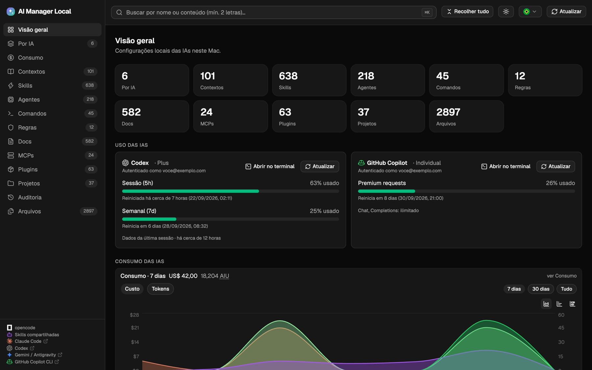

# AI Manager Local

Painel web local (somente no seu Mac) para visualizar e editar as configurações das IAs instaladas na máquina: **opencode**, **Claude Code**, **Codex**, **GitHub Copilot CLI**, **Gemini/Antigravity** e os arquivos de configuração **dentro dos seus projetos** (`~/Projetos`).

[](https://github.com/mvvitorsilvati/ai-manager-local/actions/workflows/qa.yaml)


**Sistemas operacionais:** macOS é o alvo completo (Keychain, Finder, apps nativos e seus ícones). Linux, WSL e container rodam o painel com o que é multiplataforma; as diferenças estão em [Limitações](#limitações). No WSL com as IAs instaladas no Windows, use `AIM_HOME` — veja [Usando no WSL](#usando-no-wsl-ias-instaladas-no-windows).

**Site:** https://mvvitorsilvati.github.io/ai-manager-local/ (landing page servida pelo GitHub Pages a partir de `site/`)

Roda 100% local (`127.0.0.1`), sem telemetria e sem enviar nada para fora — exceto as chamadas às APIs oficiais: uso/limites das contas (Claude, Codex e Copilot), versões publicadas no npm e as páginas de status, sempre com as credenciais que já existem na sua máquina.



## Funcionalidades principais

- **Por IA e por projeto**: tudo de cada ferramenta (opencode, Claude, Codex, Copilot, Gemini), global e por repositório em `~/Projetos`
- **Viewer e edição segura**: Markdown/Mermaid, JSON, imagens, editor Monaco com backup automático e detecção de conflito
- **Uso, consumo e skills**: limites das contas, custo/tokens por modelo, projeto e dia (gráficos) e top 20 de skills
- **Operação**: MCPs, plugins, versões e updates, abertura da IA em terminal ou app nativo, auditoria e logs
- **Busca, idiomas e tema**: busca global e contextual, interface em PT-BR/EN e modo claro/escuro

Detalhes em [O que faz](#o-que-faz).

## Índice

- [Funcionalidades principais](#funcionalidades-principais)
- [O que faz](#o-que-faz)
- [Stack](#stack)
- [Pré-requisitos](#pré-requisitos)
- [Instalação](#instalação)
- [Uso](#uso)
- [Arquitetura](#arquitetura)
- [API](#api)
- [Fontes escaneadas](#fontes-escaneadas)
- [Testes](#testes)
- [Lint e formatação](#lint-e-formatação)
- [Limitações](#limitações)
- [Solução de problemas](#solução-de-problemas)
- [Como contribuir](#como-contribuir)

## O que faz

O painel lê o que já está na sua máquina, global e por projeto, e organiza em duas navegações. Por tipo de artefato: contextos, skills, agentes, comandos, regras, docs, MCPs, plugins, arquivos e auditoria. Por IA: escolha a ferramenta (opencode, Claude, Codex, Copilot, Gemini ou o que for compartilhado) e veja tudo dela, incluindo os repositórios encontrados em `~/Projetos`.

### Leitura e edição

O viewer abre Markdown com Mermaid, JSON, imagens e texto puro, com os metadados do arquivo e o autor do último commit. A edição é no Monaco e cada gravação gera backup (10 versões por arquivo). Se o arquivo mudar por fora, o painel avisa em vez de sobrescrever. Gravações e restaurações ficam no `audit.log`.

### Busca

Na Visão geral, o campo busca por nome e por conteúdo em tudo, destacando as linhas encontradas. Nas outras telas, filtra o que está na tela.

### Uso e consumo

Os cards de uso mostram a conta autenticada e os limites do Claude Code (janelas de 5h e 7d, ou créditos), do Codex (5h e 7d, lidos do último rollout) e do GitHub Copilot (premium requests e reset mensal). O Consumo lê os logs locais das CLIs e monta gráficos de custo e tokens por dia, por modelo ou por IA, com tabelas por modelo e projeto. São preços de tabela, não a fatura; o Copilot aparece em AIU.

### Skills

Top 20 por invocações, agrupado por nome entre as IAs, com os tokens aproximados de contexto. Só Claude e opencode registram invocação localmente.

### Versões e atualizações

Compara a versão instalada de cada CLI com a última publicada no npm. O **Atualizar** roda brew, npm ou o updater da própria ferramenta; o **Copiar comando** entrega o comando para rodar no terminal. Se o canal de instalação ainda não tiver versão nova, o painel diz "Nada mudou" em vez de dar sucesso falso. Nos plugins, mostra se o update é automático ou manual e deixa alternar.

### MCPs

Ativar e desativar é no próprio card: opencode e Codex editam o config (com backup) e Copilot e Gemini passam pelo CLI. O login por OAuth também fica aqui (Claude, opencode e Codex), e o **Ver config** funciona em todos, inclusive nos MCPs do Claude, que ficam em `~/.claude.json`.

### Abrir a IA

Um ícone ao lado de cada IA abre a CLI no terminal detectado (Terminal, iTerm2 e outros) ou no app nativo (Claude, OpenCode, Gemini/Antigravity). O diretório é o do projeto quando houver contexto; fora de projeto, o `AIM_PROJECTS_DIR`.

### Status e interface

Um alerta na sidebar aparece quando a IA está com incidente ativo, consultando as páginas de status da Anthropic, OpenAI, GitHub, Google Cloud e Cursor. A interface tem PT-BR e EN, tema claro/escuro seguindo o sistema, atalhos (`⌘K`, `⌘E`, `⌘S`, `Esc`) e o botão voltar do navegador navegando entre telas, com guarda para alteração não salva.

## Logs e debug

- **Backend** (Loguru): nível por `AIM_LOG_LEVEL` (`DEBUG`, padrão `INFO`); crises vão para o stderr e tudo vai para `~/.ai_management_local/backend.log` (rotação 1 MB, 3 arquivos). `info` nas mutações (save/restore/update/mcp/open), `warning` nos 4xx, `error` com traceback nos 500, `debug` nas chamadas externas
- **Frontend** (`web/src/lib/log.ts`, sem dependências): `warn`/`error` sempre no console; `debug`/`info` só com `?debug=1` ou `localStorage "aim:debug" = "1"`. Buffer dos últimos 500 registros exportável via `downloadLogs()` (ou `__AIM_LOGS__` no console); erros não tratados e promises rejeitadas caem no log. Falhas de API geram `warn` com método, rota e status (sem corpos nem segredos)

## Stack

- **Backend**: Python 3.14, biblioteca padrão (`http.server`) + [trio](https://trio.readthedocs.io/) e [httpx](https://www.python-httpx.org/), gerenciados pelo [uv](https://docs.astral.sh/uv/)
- **Frontend**: Vite + React + TypeScript (TS 7), Tailwind CSS v4, shadcn/ui (Base UI), react-router, TanStack Query, react-markdown, Mermaid, Monaco Editor, axios, date-fns, lucide-react
- **Qualidade**: pytest (unit/integration/e2e), Vitest, Ruff, Pyright, oxlint, oxfmt
- **Orquestração de tarefas**: [just](https://github.com/casey/just)

## Pré-requisitos

| Ferramenta | Versão | Para quê |
|---|---|---|
| macOS | — | o backend usa Keychain e `open -R` (Finder); em Linux/Windows funciona, exceto esses dois recursos |
| [uv](https://docs.astral.sh/uv/) | 0.8+ | venv e dependências do backend |
| Python | 3.14 | runtime do backend |
| Node.js | 22+ | build/dev do frontend (Vite 8) |
| [pnpm](https://pnpm.io/) | 10+ | dependências do frontend |
| [just](https://github.com/casey/just) | 1.x | atalhos de tarefas (opcional) |
| Podman ou Docker | — | opcional, apenas para rodar em container |

Para os cards de uso (opcional): `gh` autenticado (Copilot) e Claude Code logado (Keychain) — sem isso, o card simplesmente não aparece.

## Instalação

```bash
git clone git@github.com:mvvitorsilvati/ai-manager-local.git
cd ai-manager-local

# instala backend (uv sync) e frontend (pnpm install)
just setup

# builda o frontend (o backend serve esse build em /)
just build
```

Sem `just`:

```bash
cd backend && uv sync && cd ..
cd web && pnpm install && pnpm build
```

## Configuração (.env)

Copie o exemplo e ajuste o que precisar:

```bash
cp .env.example .env
```

| Variável | Padrão | Descrição |
|---|---|---|
| `AIM_HOME` | home do processo | home onde o painel procura as IAs (configurações, credenciais e logs de uso). Só é necessário quando as IAs rodam em outro sistema, como no WSL com as IAs no Windows: `AIM_HOME=/mnt/c/Users/<você>` |
| `AIM_PROJECTS_DIR` | `~/Projetos` | diretório onde o painel procura os seus projetos (aceita `~`, que segue o `AIM_HOME`) |
| `AIM_PORT` | `4747` | porta do servidor local (a flag `--port` tem precedência) |
| `AIM_HOST` | `127.0.0.1` | interface de escuta; use `0.0.0.0` apenas em container (a flag `--host` tem precedência) |

O `.env` fica na raiz do repositório, é carregado com [python-dotenv](https://github.com/theskumar/python-dotenv) **sem sobrescrever** variáveis já exportadas no ambiente, e não entra no Git (apenas o `.env.example`). Alterou? Reinicie o servidor (`just stop && just run`).

## Uso

```bash
just run        # sobe e abre http://127.0.0.1:4747
just stop       # encerra a instância que estiver na porta 4747
```

| Comando | O que faz |
|---|---|
| `just run` | backend + app buildado em `http://127.0.0.1:4747` (abre o navegador) |
| `just run-nobrowser` | idem, sem abrir o navegador |
| `just dev` | frontend com hot reload em `http://127.0.0.1:5173` (proxy `/api` → 4747; suba o backend em paralelo) |
| `just build` | build do frontend em `web/dist` |
| `just test` | pytest (backend, com cobertura) + Vitest (frontend) |
| `pnpm test:e2e` (em `web/`) | E2E com Playwright (chromium) |
| `just coverage` | cobertura do backend + relatório HTML em `backend/htmlcov` |
| `just e2e` | testes E2E (Playwright) — builda o front e sobe o backend com fixture |
| `just lint` | Ruff + Pyright + oxlint |
| `just format` | oxfmt (frontend) + `ruff check --fix` (backend) |
| `just check` | lint + testes |
| `just hooks` | liga os git hooks versionados (pre-commit roda `just check`) |
| `just docker-build` | build da imagem `localhost/ai-manager-local-py-3.14:0.1.0` |
| `just docker-run` | sobe o painel em container montando o seu `$HOME` |
| `just docker-test` | roda a suíte de testes dentro da imagem (sem rede) |

### Rodando em container (Docker/Podman)

```bash
just docker-build   # podman build -t localhost/ai-manager-local-py-3.14:0.1.0 .
just docker-run     # http://127.0.0.1:4747
```

Ou com Compose: `podman compose up --build` (ou `docker compose up --build`).

O container monta o seu `$HOME` em `/host-home` (com `HOME` apontando para lá), então as fontes escaneadas, os backups e o `audit.log` continuam sendo os seus. A porta é publicada **só no loopback** do host (`127.0.0.1:4747`); dentro do container a API escuta em `0.0.0.0` via `AIM_HOST`.

Limitações no modo container: Keychain do macOS (credenciais do Claude Code) e "abrir no Finder" não existem; o card de uso do Claude depende de `~/.claude/.credentials.json`. Para rodar os testes dentro da imagem (usa a venv embutida, sem rede): `just docker-test`.

### Usando no WSL (IAs instaladas no Windows)

O painel monta as fontes a partir do home (o `AIM_PROJECTS_DIR` só muda a pasta de projetos), então ele não enxerga `C:\` sozinho. Se as IAs rodam no Windows e o painel roda no WSL, aponte o `AIM_HOME` para o perfil do Windows — no `.env` ou na linha de comando:

```bash
# nativo no WSL
AIM_HOME=/mnt/c/Users/<você> uv run --project backend backend/app.py

# container: descomente o volume e o AIM_HOME no docker-compose.yml
#   - /mnt/c/Users/<você>:/host-windows
#   AIM_HOME: /host-windows
docker compose up --build
```

Assim ele lê os arquivos das IAs, os logs de consumo e o uso do Claude (`~/.claude/.credentials.json`) e do Codex (último rollout em `~/.codex/sessions`), e os backups e o `audit.log` continuam no home real (`~/.ai_management_local`). Se as IAs rodam dentro do WSL, nada disso é necessário: o home do processo já é o certo.

O que muda em relação ao macOS:

- O card do GitHub Copilot precisa de um token: `GITHUB_TOKEN` ou `GH_TOKEN`, `gh auth token`, ou `~/.config/gh/hosts.yml`. O `gh` do Windows guarda em `%APPDATA%\GitHub CLI\`, então autentique o `gh` dentro do WSL.
- Abrir no app nativo (Claude, OpenCode, Gemini/Antigravity) e os ícones desses apps existem só no macOS. No WSL o botão oferece os terminais Linux instalados (gnome-terminal, konsole, kitty, alacritty e afins).
- "Revelar no Finder" responde `400`.
- O Windows Terminal não aparece na lista de terminais: a entrada `wt` vale só para `win32`.
- Backups e `audit.log` caem no `HOME` apontado, ou seja, em `C:\Users\<você>\.ai_management_local`.
- Varrer `/mnt/c` é mais lento que o ext4 do WSL, e caminhos `C:\...` dentro das configs aparecem apenas como texto.

### Fluxo de desenvolvimento

```bash
# terminal 1 — API
just run-nobrowser

# terminal 2 — front com HMR
just dev
```

### Atalhos de teclado

| Tecla | Ação |
|---|---|
| `⌘K` | foca a busca |
| `⌘E` | entra em edição (Monaco) |
| `⌘S` | salva (com backup automático) |
| `Esc` | fecha o painel de backups → cancela a edição (nunca fecha o preview direto) |

### Edição e backups

- Ao salvar, o arquivo anterior vai para `~/.ai_management_local/backups/<fonte>/<caminho>/<timestamp>-<nome>` (mantém as 10 versões mais recentes)
- Se o arquivo tiver mudado no disco desde que foi aberto, o salvamento é bloqueado com `409` e você escolhe entre **sobrescrever** ou **recarregar do disco**
- Toda escrita é registrada em `~/.ai_management_local/audit.log` e feita de forma atômica (`os.replace`)
- A validação de sintaxe roda antes de gravar: JSON, JSONC (com comentários) e TOML inválidos são recusados com `422`

## Arquitetura

```
ai-manager-local/
├── Dockerfile                # multi-stage: build do front (Node) + runtime (Python 3.14 + uv)
├── docker-compose.yml        # sobe o painel montando o $HOME
├── .dockerignore
├── backend/                  # API + serving do frontend
│   ├── app.py                # servidor HTTP (stdlib), catálogo, escrita, uso das IAs
│   ├── pyproject.toml        # deps (trio, httpx) + config de pytest/ruff/pyright
│   ├── uv.lock
│   └── tests/
│       ├── conftest.py       # fixtures compartilhadas
│       ├── unit/             # parsers, árvore, uso, versões, MCPs
│       ├── integration/      # save/backup/restore, git
│       └── e2e/              # servidor HTTP real (rotas e fluxos)
├── web/                      # frontend React (Vite)
│   ├── src/
│   │   ├── components/       # FileTree, Viewer, UsageCard, Markdown, CodeEditor, ui/ (shadcn)
│   │   ├── views/            # Dashboard, Por IA, categorias, Projetos, Docs, MCPs, Plugins, Busca
│   │   ├── hooks/            # useCatalog (react-query)
│   │   └── lib/              # api (axios), format (date-fns), monaco-setup
│   └── .oxfmtrc.json / .oxlintrc.json
└── justfile                  # tarefas do projeto
```

### Como as coisas conversam

```
Navegador (React SPA em /)  ──HTTP/JSON──▶  backend/app.py (127.0.0.1:4747)
        │                                        │
        │  /api/catalog, /api/file, ...          ├─ lê o filesystem (fontes + projetos)
        │  POST /api/save (X-AIM: 1)          ├─ escreve com backup/atômico/auditoria
        ▼                                        └─ consulta as APIs de uso (Claude/Codex/Copilot)
   web/dist (build)  ◀── servido pelo mesmo processo
```

O backend escaneia as fontes a cada requisição de catálogo (sem banco de dados). O frontend cacheia com TanStack Query (catálogo 10 s, uso 5 min com `refetchInterval`).

### Segurança

- Servidor escuta apenas `127.0.0.1` por padrão; em container, `AIM_HOST=0.0.0.0` com a porta publicada somente no loopback do host
- Todo `POST` exige o header `X-AIM: 1` (bloqueia CSRF de páginas externas)
- `resolve_file` garante que qualquer caminho resolvido está dentro de uma fonte permitida (sem traversal) e nega binários/extensões excluídas
- A API nunca devolve headers/segredos extraídos de configs (ex.: `Authorization` de MCPs)

## API

| Método | Rota | Descrição |
|---|---|---|
| GET | `/` | frontend React (build em `web/dist`; `503` com instrução se não houver build) |
| GET | `/api/catalog` | fontes, projetos, ferramentas, arquivos, skills, MCPs e plugins |
| GET | `/api/file?s=&r=` | conteúdo + metadados (tamanho, mtime, mtime_ns, criado, dono, git) |
| GET | `/api/raw?s=&r=` | bytes crus (imagens, até 20 MB) |
| GET | `/api/search?q=` | busca por nome e conteúdo |
| GET | `/api/backups?s=&r=` | versões de backup do arquivo |
| GET | `/api/usage[?refresh=1][&tool=claude\|codex\|copilot]` | uso/limites de Claude, Codex e Copilot (cache 60 s); `tool` limita o refresh a uma IA |
| GET | `/api/spend[?days=7][&tool=][&refresh=1]` | custo e tokens locais (claude, codex, opencode, copilot). `days=0` lê tudo. Cache 60 s |
| GET | `/api/skill-usage[?days=7][&tool=][&refresh=1]` | invocações de skills e tokens aprox. de contexto, com top 20 global agrupado por nome. Só Claude e opencode têm registro; Codex/Copilot vêm com nota. Cache 60 s |
| GET | `/api/versions[?refresh=1]` | versões instaladas/últimas das CLIs, contas autenticadas e atualizações de plugins (cache 10 min) |
| GET | `/api/incidents[?refresh=1]` | incidentes ativos nas status pages das IAs (cache 5 min) |
| GET | `/api/audit[?limit=200]` | últimas gravações do painel (save/restore) do `audit.log` |
| POST | `/api/save` | salva `{s, r, content, mtime_ns?, force?}` (409 em conflito, 422 em sintaxe inválida) |
| POST | `/api/restore` | restaura `{s, r, backup}` (o estado atual vira backup antes) |
| POST | `/api/authors` | autores (autor/committer/co-autores) em lote para a lista de recentes |
| POST | `/api/reveal` | abre o arquivo no Finder (macOS) |
| POST | `/api/update` | atualiza uma CLI (`{tool}`) ou um plugin (`{source, name}`) para a versão mais recente |
| POST | `/api/plugin-auto-update` | liga/desliga o update automático de um marketplace (`{name, auto}`) no `settings.json` do Claude Code |
| POST | `/api/mcp` | ativa/desativa (`enable`/`disable`) ou autentica/desconecta (`login`/`logout`) um MCP (`{source, name, action}`) |
| GET | `/api/open-targets?tool=` | terminais detectados e apps nativos vinculados à IA |
| GET | `/api/app-icon?app=` | PNG do ícone do app nativo (só ids do registro; 404 fora dele) |
| POST | `/api/open` | abre a IA (`{tool, target: "terminal:<id>"\|"app:<id>", project?}`; projeto resolve só contra fontes registradas) |

## Fontes escaneadas

| Fonte | Caminho | Observações |
|---|---|---|
| opencode | `~/.config/opencode` | `opencode.jsonc`, `agent/`, `command/`, `skills/`, `shared/`, `instructions/` |
| Skills compartilhadas | `~/.agents/skills` | skills usadas por múltiplas ferramentas |
| Claude Code | `~/.claude` | `CLAUDE.md`, `agents/`, `commands/`, `skills/`, `rules/`, `settings.json` |
| Codex | `~/.codex` | `config.toml`, `AGENTS.md`, `prompts/`, `rules/`, `skills/` |
| GitHub Copilot CLI | `~/.copilot` | `settings.json`, `mcp-config.json`, `hooks/`, `skills/` |
| Gemini / Antigravity | `~/.gemini` | `GEMINI.md`, `settings.json`, `config/`, `skills/` |
| Cursor | `~/.cursor` | `mcp.json` global, `.cursor/`, `.cursorrules`/`.windsurfrules` nos projetos (aparece só se existir) |
| Projetos | `AIM_PROJECTS_DIR` (padrão `~/Projetos`) | detecta repos (`.git` ou nível raso) e varre só os caminhos de configuração + `docs/` |

### Adicionar uma IA nova

O registro `TOOLS` em `backend/app.py` é o ponto único de parametrização: uma entrada define o diretório global (`root`), os caminhos de projeto (`dirs`/`files`), o arquivo de MCP (`mcp.rel` + `kind`/`container`), o CLI (`cli`, para versão/update), autenticação (`mcp_login`/`mcp_logout`, `mcp_enable`/`mcp_disable`) e a status page (`status`). A sidebar e a tela "Por IA" só exibem o que está configurado (diretório existente).

Além do registro, o painel faz **auto-discovery** de IAs não mapeadas: qualquer `~/.<ia>/mcp.json` (ou `.mcp.json`/`mcp_config.json`) com `mcpServers` — e também `~/Library/Application Support/<IA>/**/mcp.json` (Trae, Kiro e afins) — vira uma fonte automaticamente, com MCPs listados e liga/desliga pelo painel (ícone genérico até você adicionar a marca no `ToolIcon`).

Exclusões automáticas: binários e caches por extensão (`.pyc`, `.zip`, `.pdf`, fontes, áudio, SQLite e seus `-wal/-shm/-journal`), históricos `.jsonl`, diretórios de sessão/cache (`sessions/`, `projects/`, `cache/`, `worktrees/`, `session-state/`, `run/`) e arquivos de credenciais (`auth.json`).

## Testes

```bash
just test                      # tudo
cd backend && uv run pytest    # só backend (75 testes)
cd backend && uv run pytest tests/unit         # parsers/árvore
cd backend && uv run pytest tests/integration  # save/backup/restore, git
cd backend && uv run pytest tests/e2e          # servidor HTTP real
cd web && pnpm test                            # Vitest (6 testes)
```

- `tests/unit`: funções puras (JSONC, categorização, skills, MCPs) e varredura de diretórios
- `tests/integration`: escrita com backup, conflito por nanossegundos, restauração, leitura de autoria via git
- `tests/e2e`: sobe o servidor de verdade em porta efêmera e exercita catálogo, leitura, salvamento (incluindo `403` sem header e `409` em conflito), backups, restore e a rota `/`

### Testes E2E (Playwright)

Sobem o app de verdade: build do frontend + backend real (uv) com `AIM_PROJECTS_DIR` apontando para uma fixture em `web/e2e/.tmp` (copiada de `web/e2e/fixtures` a cada execução, então o teste de salvar não altera arquivos versionados).

```bash
just e2e                     # build + playwright test
cd web && pnpm test:e2e      # sem rebuild
```

Cobrem: carregar a visão geral, listar o projeto fixture e abrir arquivo no viewer, busca por ⌘K, edição no Monaco com ⌘S (conferindo o arquivo no disco) e Esc cancelando a edição. A digitação usa colagem (o `keyboard.type` perde teclas no Monaco) e, no CI, testes *flaky* reprovam o job (`failOnFlakyTests`).

Se o download do chromium estiver bloqueado na sua rede, use o Chrome do sistema:

```bash
cd web && pnpm test:e2e:chrome   # PLAYWRIGHT_CHANNEL=chrome
```

Cobertura (pytest-cov, configurada em `[tool.coverage.*]` do `backend/pyproject.toml`):

```bash
just coverage                                  # HTML em backend/htmlcov/index.html
cd backend && uv run pytest --cov-report=html  # idem, sem o just
cd backend && uv run pytest --cov=app          # só o resumo no terminal
```

O resumo sai automaticamente a cada `pytest` (79% de linhas/branches hoje).

## Lint e formatação

```bash
just lint     # ruff check + pyright (backend) e oxlint (frontend)
just format   # ruff check --fix + oxfmt
```

Configurações ficam em: `backend/pyproject.toml` (`[tool.ruff]`, `[tool.pyright]`, `[tool.pytest.ini_options]`), `web/.oxfmtrc.json` e `web/.oxlintrc.json`.

## Limitações

O painel mostra o que as ferramentas deixam no disco. O que elas não registram, ele não inventa.

- **Skills por invocação**: só Claude Code e opencode gravam esse histórico. Nas outras IAs a tela lista as skills que existem em disco, sem contagem de uso.
- **Consumo**: custo e tokens saem dos logs locais com preço de tabela, não da sua fatura. O Copilot aparece em AIU.
- **Uso e limites**: os cards só aparecem com a IA autenticada na máquina e variam conforme o plano (janelas de 5h e 7d, créditos ou premium requests).
- **macOS**: Keychain, "abrir no Finder", apps nativos e os ícones desses apps existem só lá. Fora do macOS o botão do Finder fica desabilitado, com aviso no tooltip, e o botão de abrir oferece apenas os terminais instalados.
- **WSL com as IAs no Windows**: é preciso apontar o `AIM_HOME` para `/mnt/c/Users/<você>` (veja [Usando no WSL](#usando-no-wsl-ias-instaladas-no-windows)); o Windows Terminal não é detectado e a varredura em `/mnt/c` é mais lenta que no ext4.
- **Sem banco de dados**: o catálogo é lido do disco a cada requisição; em `~/Projetos` grande a primeira carga demora mais e o front cacheia por 10 s.
- **Escrita**: o painel grava configurações das IAs e o próprio estado (`~/.ai_management_local`). Nada é instalado ou atualizado sem você clicar em **Atualizar**.

## Solução de problemas

**`Address already in use` ao subir**
Já existe uma instância na porta 4747:
```bash
just stop      # encerra quem estiver na 4747
just run
```

**`ModuleNotFoundError: httpx/trio` ao rodar `python3 app.py`**
Você está fora da venv. Use `just run` (ou `cd backend && uv run app.py`), ou sincronize com `uv sync`.

**Aviso de build ausente em `/`**
O backend responde `503` pedindo o build quando `web/dist` não existe. Rode `just build`.

**Cards de uso aparecem com "sem dados"**
- Claude: precisa do Claude Code logado (Keychain) ou `~/.claude/.credentials.json`
- Copilot: precisa de `GITHUB_TOKEN`/`GH_TOKEN` ou `gh auth token`
- Codex: lê o último rollout em `~/.codex/sessions` — sem sessão recente, não há dados
- opencode (Zen/Go) e Gemini/Antigravity não expõem uso localmente; o consumo do Zen aparece só no console da opencode

**Os projetos não aparecem / aparecem de outro diretório**
Confira `AIM_PROJECTS_DIR` no `.env` (o valor atual aparece no subtítulo da tela *Projetos*) e reinicie o servidor.

**Edição recusada com 409**
O arquivo mudou no disco (outra ferramenta, IA ou IDE). Escolha *recarregar do disco* ou *sobrescrever*; nada é perdido — a versão anterior vira backup.

## Como contribuir

Detalhes completos em [CONTRIBUTING.md](CONTRIBUTING.md) (branches, nível certo de teste, convenções). Resumo:

1. Crie uma branch a partir de `develop`:
   ```bash
   git checkout -b feat/minha-mudanca
   ```
2. Faça commits pequenos e descritivos (Conventional Commits: `feat:`, `fix:`, `chore:`, `test:`, `docs:`).
3. O repositório tem **pre-commit** versionado em `.githooks/` (ativado pelo `just setup` ou `just hooks`): todo commit roda `just check` (ruff + pyright + oxlint + pytest + vitest). Para pular pontualmente, use `git commit --no-verify`.
4. Antes de abrir o PR, rode:
   ```bash
   just check   # ruff + pyright + oxlint + pytest + vitest
   ```
5. Abra o PR em modo draft descrevendo o que mudou e como validar.

Ao contribuir, siga também a política de segurança em [SECURITY.md](.github/SECURITY.md) — nada de credenciais no diff.

Diretrizes rápidas:

- **Backend**: nada de dependência nova sem necessidade; prefira a biblioteca padrão. Se `app.py` crescer, mantenha as fronteiras (catálogo / escrita / uso das IAs) e escreva o teste no nível certo (`unit` para função pura, `integration` para filesystem/git, `e2e` para rota).
- **Frontend**: componentes em `src/components`, telas em `src/views`; chamadas HTTP só pelo `lib/api.ts` (axios); datas pelo `lib/format.ts` (date-fns).
- **Nada de segredos**: o app lê credenciais em runtime; nunca versione tokens, `auth.json`, logs de auditoria ou backups.

## Licença

MIT — veja [LICENSE](LICENSE). A convivência no projeto segue o [Código de Conduta](CODE_OF_CONDUCT.md).
